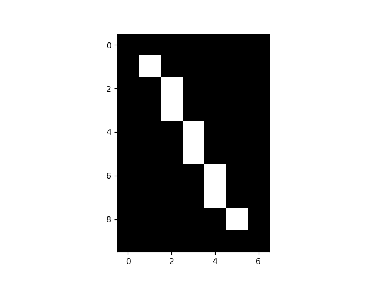

# Bresenham Line Algorithm

Implementação simples da definição de pontos a partir de coordenadas geográficas utilizando o algoritmo de Bresenham.

## Instalação

Essa chamada exige o Python 3.10. Assim, você pode instalar um venv para tal:

```bash
python3.10 -m venv venv
source venv/bin/activate
```

Em seguida, instale as dependências:

```bash
pip install -r requirements
```

## Execução

Para executar o programa, basta executar o arquivo `main.py` passando as coordenadas geográficas como argumentos:

```bash
python main.py 1 1 8 5
```

O sistema devolverá os pontos que compõem a linha. Por exemplo, para a chamada anterior o resultado será:

```bash
c1(1,1)
c2(2,2)
c3(3,2)
c4(4,3)
c5(5,3)
c6(6,4)
c7(7,4)
c8(8,5)
```

Além disso, o programa também gera um arquivo `output.png` com a imagem da linha gerada, que será salvo em `output/`:


